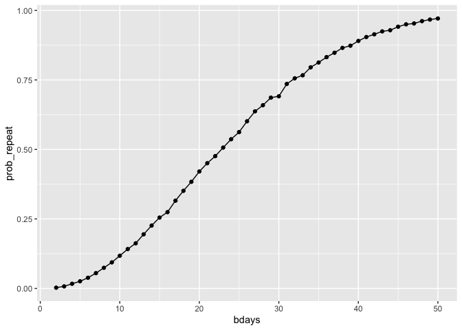
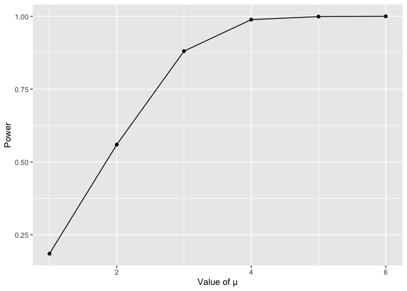
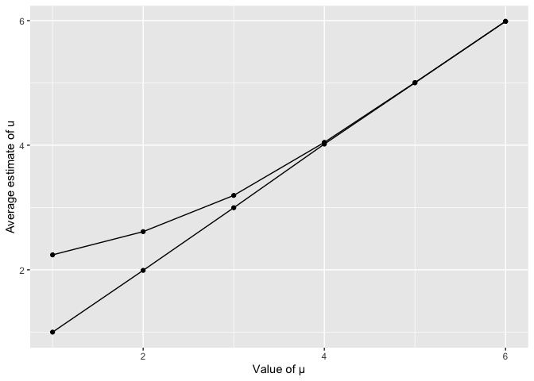
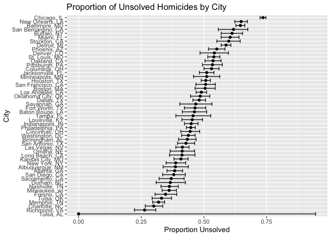

Homework 5
================
Evan Kennedy, ELK2149
2025-11-8

***Problem 1***

# make initial function, after pulling in necessary libaries for the whole project

``` r
library(dplyr)
```

    ## 
    ## Attaching package: 'dplyr'

    ## The following objects are masked from 'package:stats':
    ## 
    ##     filter, lag

    ## The following objects are masked from 'package:base':
    ## 
    ##     intersect, setdiff, setequal, union

``` r
library(tidyr)
library(purrr)
library(ggplot2)
library(broom)
library(tidyverse)
```

    ## ── Attaching core tidyverse packages ──────────────────────── tidyverse 2.0.0 ──
    ## ✔ forcats   1.0.0     ✔ stringr   1.5.1
    ## ✔ lubridate 1.9.4     ✔ tibble    3.3.0
    ## ✔ readr     2.1.5

    ## ── Conflicts ────────────────────────────────────────── tidyverse_conflicts() ──
    ## ✖ dplyr::filter() masks stats::filter()
    ## ✖ dplyr::lag()    masks stats::lag()
    ## ℹ Use the conflicted package (<http://conflicted.r-lib.org/>) to force all conflicts to become errors

``` r
library(janitor)
```

    ## 
    ## Attaching package: 'janitor'
    ## 
    ## The following objects are masked from 'package:stats':
    ## 
    ##     chisq.test, fisher.test

``` r
birthdays = sample(1:365, 5, replace = TRUE)

repeated_bday = length(unique(birthdays)) < 5

repeated_bday
```

    ## [1] FALSE

\#put this in a function

``` r
bday_sim = function(n_room) {

    birthdays = sample(1:365, n_room, replace = TRUE)

    repeated_bday = length(unique(birthdays)) < n_room

    repeated_bday
    
}

bday_sim(5)
```

    ## [1] FALSE

\#make it from 10000 iterations, group by bdays

``` r
bday_sim_results = 
  expand_grid(
    bdays = 2:50,
    iter = 1:10000
  ) |> 
  mutate(
    result = map_lgl(bdays, bday_sim)
  ) |> 
  group_by(
    bdays
    ) |> 
  summarize(
    prob_repeat = mean(result)
  )
  
bday_sim_results
```

    ## # A tibble: 49 × 2
    ##    bdays prob_repeat
    ##    <int>       <dbl>
    ##  1     2      0.0023
    ##  2     3      0.0078
    ##  3     4      0.0162
    ##  4     5      0.0282
    ##  5     6      0.0391
    ##  6     7      0.0566
    ##  7     8      0.0721
    ##  8     9      0.0974
    ##  9    10      0.117 
    ## 10    11      0.133 
    ## # ℹ 39 more rows

\#plot this

``` r
bday_sim_results |> 
  ggplot(aes(x = bdays, y = prob_repeat)) +
  geom_point() +
  geom_line()
```

<!-- -->

\#the probability of having two people with the same birthday does not
increase at a linear pace as the group size increased from 2 to 50
people.

***Problem 2***

``` r
#set variables
n = 30
sd = 5
u = 0
a = 0.05

#run the single function

run_one = function(u, n, sd) {
  x = rnorm(n, mean = u, sd = sd)
  t_test = t.test(x, mu = 0)
  tibble(
    sample_mean  = mean(x),
    p_value = tidy(t_test)$p.value
  )
}

#run the larger simulation
simulation = 
  expand_grid(iter = 1:5000) |> 
  mutate(out = map(iter, ~ run_one(u = u, n = n, sd = sd))) |>
  unnest(out)

#estimate type 1 error
estimated_type1_error =
  simulation |>
  summarize(type1 = mean(p_value < a)) |>
  pull(type1)

estimated_type1_error
```

    ## [1] 0.0456

``` r
simulation_1 = 
  expand_grid(
    u = 1:6,
    iter = 1:5000
  ) |>
  mutate(out = map(u, ~ run_one(u = .x, n = n, sd = sd))) |>
  unnest(out)

#calculate power
power_results = 
  simulation_1 |>
  mutate(reject = p_value < a) |>
  group_by(u) |>
  summarize(
    power = mean(reject)
  )

power_results
```

    ## # A tibble: 6 × 2
    ##       u power
    ##   <int> <dbl>
    ## 1     1 0.185
    ## 2     2 0.559
    ## 3     3 0.880
    ## 4     4 0.989
    ## 5     5 0.999
    ## 6     6 1

``` r
#graph power results
power_results |>
  ggplot(aes(x = u, y = power)) +
  geom_point() +
  geom_line() +
  labs(
    x = "Value of μ",
    y = "Power"
  )
```

<!-- -->

# Power increases as μ increases.

``` r
#
estimates_1 =
  simulation_1 |>
  mutate(reject = p_value < a) |>
  group_by(u) |>
  summarize(
    mean_hat = mean(sample_mean),
    mean_hat_reject = mean(sample_mean[reject]),
    .groups = "drop"
  )

#double plot of estimate of U and estimate of U only when null was rejected

estimates_1 |>
  ggplot(aes(x = u)) +
  geom_point(aes(y = mean_hat)) +
  geom_line(aes(y = mean_hat)) +
  geom_point(aes(y = mean_hat_reject)) +
  geom_line(aes(y = mean_hat_reject)) +
  labs(
    x = "Value of μ",
    y = "Average estimate of u"
  )
```

<!-- -->

\#Across all simulations, the average u estimate is approximately the
true u. When restricting to rejected tests, the average u is inflated,
especially for small u values.

***Problem 3***

``` r
#first, pull in dataset

homicides = 
  read_csv("https://raw.githubusercontent.com/washingtonpost/data-homicides/master/homicide-data.csv") |> 
  clean_names()
```

    ## Rows: 52179 Columns: 12
    ## ── Column specification ────────────────────────────────────────────────────────
    ## Delimiter: ","
    ## chr (9): uid, victim_last, victim_first, victim_race, victim_age, victim_sex...
    ## dbl (3): reported_date, lat, lon
    ## 
    ## ℹ Use `spec()` to retrieve the full column specification for this data.
    ## ℹ Specify the column types or set `show_col_types = FALSE` to quiet this message.

``` r
#create city_state variable
homicides =
  homicides |>
  mutate(city_state = str_c(city, ", ", state))

homicides |> select(city, state, city_state) |> head()
```

    ## # A tibble: 6 × 3
    ##   city        state city_state     
    ##   <chr>       <chr> <chr>          
    ## 1 Albuquerque NM    Albuquerque, NM
    ## 2 Albuquerque NM    Albuquerque, NM
    ## 3 Albuquerque NM    Albuquerque, NM
    ## 4 Albuquerque NM    Albuquerque, NM
    ## 5 Albuquerque NM    Albuquerque, NM
    ## 6 Albuquerque NM    Albuquerque, NM

\#now collected all unsolved cases for each

``` r
city_summaries =
  homicides |>
  mutate(unsolved_cases = disposition %in% c("Closed without arrest", "Open/No arrest")) |>
  group_by(city_state) |>
  summarize(
    total = n(),
    unsolved = sum(unsolved_cases),
    .groups = "drop"
  )

city_summaries
```

    ## # A tibble: 51 × 3
    ##    city_state      total unsolved
    ##    <chr>           <int>    <int>
    ##  1 Albuquerque, NM   378      146
    ##  2 Atlanta, GA       973      373
    ##  3 Baltimore, MD    2827     1825
    ##  4 Baton Rouge, LA   424      196
    ##  5 Birmingham, AL    800      347
    ##  6 Boston, MA        614      310
    ##  7 Buffalo, NY       521      319
    ##  8 Charlotte, NC     687      206
    ##  9 Chicago, IL      5535     4073
    ## 10 Cincinnati, OH    694      309
    ## # ℹ 41 more rows

\#focusing on baltimore

``` r
baltimore =
  city_summaries |>
  filter(city_state == "Baltimore, MD")

baltimore
```

    ## # A tibble: 1 × 3
    ##   city_state    total unsolved
    ##   <chr>         <int>    <int>
    ## 1 Baltimore, MD  2827     1825

``` r
baltimore_test =
  prop.test(
    x = baltimore$unsolved,
    n = baltimore$total
  )

baltimore_tidy =
  tidy(baltimore_test)

baltimore_tidy |>
  select(estimate, conf.low, conf.high)
```

    ## # A tibble: 1 × 3
    ##   estimate conf.low conf.high
    ##      <dbl>    <dbl>     <dbl>
    ## 1    0.646    0.628     0.663

\#now run the function for all cities

``` r
city_results =
  city_summaries |>
  mutate(
    test = map2(unsolved, total, ~ prop.test(.x, .y))
  ) |>
  mutate(
    test_tidy = map(test, tidy)
  ) |>
  unnest(test_tidy)
```

    ## Warning: There was 1 warning in `mutate()`.
    ## ℹ In argument: `test = map2(unsolved, total, ~prop.test(.x, .y))`.
    ## Caused by warning in `prop.test()`:
    ## ! Chi-squared approximation may be incorrect

``` r
city_results =
  city_results |>
  select(city_state, total, unsolved, estimate, conf.low, conf.high)

city_results
```

    ## # A tibble: 51 × 6
    ##    city_state      total unsolved estimate conf.low conf.high
    ##    <chr>           <int>    <int>    <dbl>    <dbl>     <dbl>
    ##  1 Albuquerque, NM   378      146    0.386    0.337     0.438
    ##  2 Atlanta, GA       973      373    0.383    0.353     0.415
    ##  3 Baltimore, MD    2827     1825    0.646    0.628     0.663
    ##  4 Baton Rouge, LA   424      196    0.462    0.414     0.511
    ##  5 Birmingham, AL    800      347    0.434    0.399     0.469
    ##  6 Boston, MA        614      310    0.505    0.465     0.545
    ##  7 Buffalo, NY       521      319    0.612    0.569     0.654
    ##  8 Charlotte, NC     687      206    0.300    0.266     0.336
    ##  9 Chicago, IL      5535     4073    0.736    0.724     0.747
    ## 10 Cincinnati, OH    694      309    0.445    0.408     0.483
    ## # ℹ 41 more rows

\#now plot this, using error bars

``` r
city_results |>
  mutate(city_state = fct_reorder(city_state, estimate)) |>
  ggplot(aes(x = city_state, y = estimate)) +
  geom_point() +
  geom_errorbar(aes(ymin = conf.low, ymax = conf.high)) +
  coord_flip() +
  labs(
    x = "City",
    y = "Proportion Unsolved",
    title = "Proportion of Unsolved Homicides by City"
  )
```

<!-- -->
